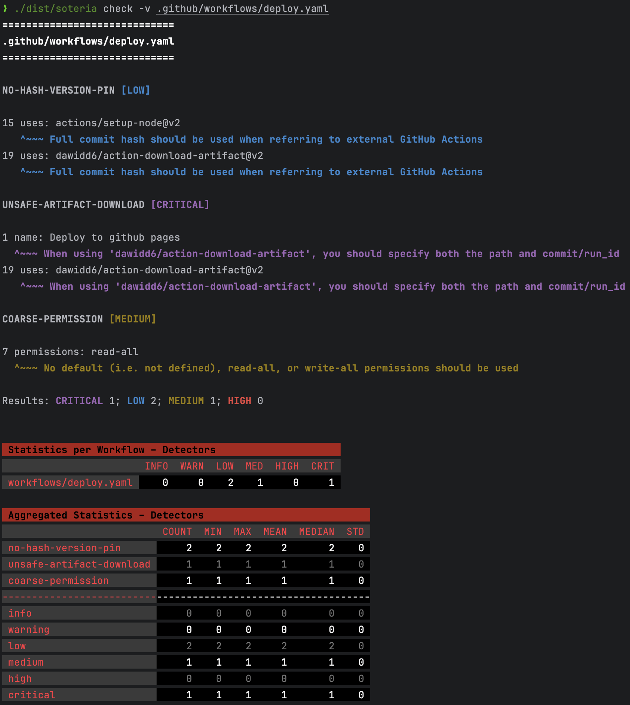

<p align="center">
   <br><br>
  
  
</p>

# Soteria

_Soteria_ is a misconfiguration detector for GitHub workflow files. It has been designed to be modular, so that custom detectors can be added by the user. This tool caters to both developers and researchers, offering outputs for developers and JSON files containing detailed results for researchers.

## Use Cases

### Developers

Developers can use _Soteria_ to detect misconfigurations in workflows before pushing the code to GitHub. The output of the tool will help the developer identify where the misconfigurations are exactly, together with a table showing the summary of the findings. Below is an example of a check ran on the `.github/workflows` directory of a project.



### Researchers

Researchers can use the JSON files returned by _Soteria_ to analyze large datasets of workflows and study the misconfigurations in them. For example, we used _Soteria_ to perform an empirical study of misconfigurations in GitHub CI/CD workflows. 

## Default Misconfigurations

- **CICD-SEC-3**: Dependency Chain Abuse
- **CICD-SEC-4**: Poisoned Pipeline Execution
- **CICD-SEC-5**: Insufficient Pipeline-Based Access Controls (PBAC)
- **CICD-SEC-7**: Insecure System Configuration
- **CICD-SEC-9**: Improper Artifact Integrity Validation

Below is a table of the default misconfigurations grouped by category.

| Category   | Misconfiguration           | Severity | Rule                                                                                                 |
|------------|----------------------------|----------|------------------------------------------------------------------------------------------------------|
| CICD-SEC-3 | `no-hash-version-pin`      | Low      | [here](./app/internal/detectors/dependency-chain-abuse/no-hash-version-pin.go)                       |
| CICD-SEC-4 | `unconditional-injection`  | High     | [here](./app/internal/detectors/poisoned-pipeline-execution/unconditional-injection.go)              |
|            | `conditional-injection`    | Medium   | [here](./app/internal/detectors/poisoned-pipeline-execution/conditional-injection.go)                |
|            | `pwn-request`              | High     | [here](./app/internal/detectors/poisoned-pipeline-execution/pwn-request.go)                          |
| CICD-SEC-5 | `coarse-permission`        | Medium   | [here](./app/internal/detectors/insufficient-pbac/coarse-permission.go)                              |
|            | `global-secret`            | Medium   | [here](./app/internal/detectors/insufficient-pbac/global-secret.go)                                  |
| CICD-SEC-7 | `self-hosted-runner`       | Medium   | [here](./app/internal/detectors/insecure-system-configuration/self-hosted-runner.go)                 |
| CICD-SEC-9 | `caching-in-release`       | Critical | [here](./app/internal/detectors/improper-artifact-integrity-validation/caching-in-release.go)        |
|            | `unsafe-artifact-download` | Critical | [here](./app/internal/detectors/improper-artifact-integrity-validation/unsafe-artifact-download.go)  |

## Commands

_Soteria_ has 3 commands: `check`, `stats`, and `detectors`. Each command has also a set of flags that can be used.

### Check

```
NAME:
   soteria check - Perform a static analysis check on the given file(s) or directory

USAGE:
   soteria check [command options]

OPTIONS:
   --config value, -c value    Path to the configuration file
   --repo value, -r value      Name of the repository (will be used to name the global results file)
   --string, -s                YAML being passed as string (default: false)
   --verbose, -v               Verbose mode (default: false)
   --max-rows value, -m value  Maximum number of rows to print for the statistics table (default: 10)
   --global, -g                Output only one global JSON file per repository with the aggregated results (default: false)
   --out value, -o value       Output directory for the workflows' statistics (one JSON file per workflow will be generated, plus a global one)
   --help, -h                  show help
```

### Stats

```
NAME:
   soteria stats - Compute file structure statistics on the given file(s) or directory (only for GitHub workflow files)

USAGE:
   soteria stats [command options]

OPTIONS:
   --repo value, -r value      Name of the repository (will be used to name the global results file)
   --string, -s                YAML being passed as string (default: false)
   --max-rows value, -m value  Maximum number of rows to print for the statistics table (default: 10)
   --global, -g                Output only one global JSON file per repository with the aggregated statistics (default: false)
   --out value, -o value       Output directory for the workflows' statistics (one JSON file per workflow will be generated, plus a global one)
   --help, -h                  show help
```

### Detectors

```
NAME:
   soteria detectors - Get the list of all the available detectors. If the 'config' flag is set, it returns the detectors enabled by that configuration file

USAGE:
   soteria detectors [command options]

OPTIONS:
   --config value, -c value  Path to the configuration file
   --help, -h                show help

```

## Configuration File

A YAML configuration file can be optionally passed to _Soteria_. This file defines some options that the tool will set based on the developer's preferences. For instance, a developer can indicate which detectors should be used in the static analysis. To tell _Soteria_ which detectors to use, the following syntax can be used:

```yaml
detectors:
  method: "include"
  names:
    - "poisoned-pipeline-execution/pwn-request"
    - "insufficient-pbac/*"
```

In the case above, we are telling the tool to use the `pwn-request` detector together with all detectors present in the `insufficient-pbac` group (denoted by the `/*`). If, instead, we want to exclude specific detectors, the following syntax can be used:

```yaml
detectors:
  method: "exclude"
  names:
    - "poisoned-pipeline-execution/*"
    - "dependency-chain-abuse/no-hash-version-pin"
```

In the case above, all but the `no-hash-version-pin` misconfiguration and the misconfigurations present in the `poisoned-pipeline-execution` group will be used during the analysis of the workflow.